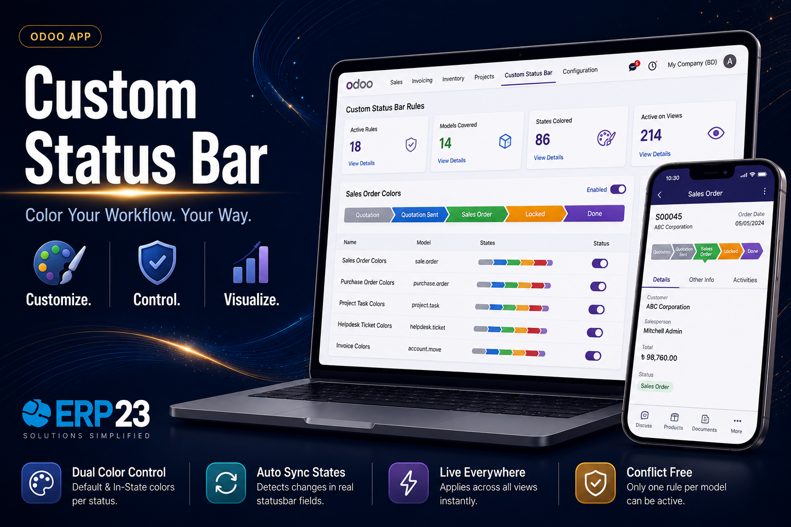
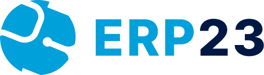

# Odoo Module index.html Generator

Generates the Odoo Apps Store `index.html` description page for a module, adapted from the Natural Foods theme reference file. All "theme" language is replaced with "module" language throughout — this template is for modules, not themes.

## Design tokens (nopstation-erp23-branding palette — do not invent new colors)

Sourced from the `nopstation-erp23-branding` skill's ERP23 color table. Cross-check that skill before starting a page.

| Role | Hex | Usage |
|---|---|---|
| Dark Navy (headings, body text) | `#001844` | H1–H6, primary text |
| Primary Blue (primary accent) | `#00A0DB` | links, icon tiles, badges, highlighted numbers |
| Success Green | `#2ECC71` | "supported" badges / check icons only |
| Accent Orange | `#FBAF33` | occasional icon-tile variety — sparingly, never headings/body |
| Accent Purple | `#8E59FD` | occasional icon-tile variety — sparingly, never headings/body |
| Accent Pink | `#FE0C7D` | occasional icon-tile variety — sparingly, never headings/body |
| Gray (body copy) | `#797F8B` | descriptions, paragraph text |
| Light Gray (borders) | `#BDC3C7` | stronger dividers where needed |
| Light gray hairline | `#DCE1E8` | default card borders |
| Off White (panel backgrounds) | `#ECF0F1` | secondary section backgrounds (e.g. achievements) |
| Off-white (page canvas) | `#F7F9FC` | `<body>` background |
| White | `#FFFFFF` | card backgrounds |

Do not reuse the old reference file's green/slate scheme (`#2f8f46`, `#1f6b33`, `#e8f5eb`, `#eef2f6`, `#1a1a1a`, `#666666`, `#e0e0e0`, `#2563eb`, `#64748b`) — every one of those maps onto a token above and must be swapped.

## Required `<head>` assets

```html
<link href="https://cdn.jsdelivr.net/npm/bootstrap@5.3.3/dist/css/bootstrap.min.css" rel="stylesheet">
```

Body base style:

```html
<body style="margin:0;font-family:-apple-system,BlinkMacSystemFont,'Segoe UI',Roboto,Arial,sans-serif;background:#F7F9FC;color:#001844;line-height:1.6;">
```

Container: `max-width:1200px;margin:0 auto;padding:40px 20px 80px;`

## Asset organization (mandatory)

Do not keep separate `icon/` and `img/` folders. Before building the page, copy every image actually referenced by the generated `index.html` — icons, badges, screenshots, banner, achievement graphics, logo — into a single `assets/` folder next to `index.html`, and point every `src` at `./assets/{{filename}}`. Only copy files that are actually used on the page; don't bulk-copy an entire source folder if parts of it are unused.

**Watch for filename collisions when consolidating.** `icon/` and `img/` are frequently maintained separately and can contain same-named-but-different files (e.g. a small `cart.png` icon in `icon/` and an unrelated `cart.png` full-page screenshot in `img/`). A blind copy silently overwrites one with the other. Rename on the way in to keep them distinct — e.g. `cart-icon.png` for the icon-tile glyph vs. `cart-page.png` for the page screenshot — and update every `src` reference to match the renamed file.

### Current `assets/` contents — mapped to page sections

Only the files actually present in `assets/` right now are mapped below. Everything else the template references (`main_screenshot.png` for the banner, the Screenshots gallery images, and any exclusive-feature spotlight screenshots such as `widget.png`/`quick_view.png`/`snippet.png`/`cart-page.png`) is **not currently in the folder** — those still need to be supplied before this page can ship; don't reference a filename in `index.html` that isn't actually sitting in `assets/`.

| Asset | Used in | Notes |
|---|---|---|
| `logo.png` | Compatibility header | module logo |
| `products.png` | Core Features icon tile | |
| `language.png` | Core Features icon tile | |
| `snippets-set.png` | Core Features icon tile | |
| `responsive.png` | Core Features icon tile | |
| `cart-icon.png` | Core Features icon tile | kept distinct from any cart-page screenshot to avoid the filename collision noted above |
| `check-circle.svg` | Compatibility header badges | "supported" state |
| `close-circle.svg` | Compatibility header badges | "not supported" state |
| `gear.svg` | Our Services icon | e.g. Odoo Customization |
| `wrench-icon.svg` | Our Services icon | e.g. Odoo Implementation |
| `life-ring-icon.svg` | Our Services icon | e.g. Odoo Support |
| `arrows-repeat.svg` | Our Services icon | e.g. Odoo Migration |
| `puzzle-piece-icon.svg` | Our Services icon | e.g. Odoo Integration |
| `odoo-consultancy.svg` | Our Services icon | e.g. Odoo Consultancy |
| `odoo-licencing.svg` | Our Services icon | e.g. Odoo Licensing |
| `hire-odoo.svg` | Our Services icon | e.g. Hire Odoo Developer |
| `silver-partner.webp` | Why Choose ERP23 stat card | |
| `countries-served.webp` | Why Choose ERP23 stat card | |
| `projects-completed.webp` | Why Choose ERP23 stat card | |
| `industries-served.webp` | Why Choose ERP23 stat card | |
| `certifications.webp` | Why Choose ERP23 stat card | |
| `years-experience.webp` | Why Choose ERP23 stat card | |
| `erp23.png` | Support & Company | ERP23 logo |

**Still missing from `assets/`** (needed before the page is complete): the banner/main screenshot (`main_screenshot.png`), every image for the Screenshots gallery (step 7), and any per-feature images for the exclusive-feature spotlight sections (step 8) — a `layout.png`-equivalent icon for a "storefront layout" style Core Feature is also absent. Source these from the module's own screenshots rather than reusing unrelated theme artwork.

Any source file with spaces or mixed case in its name gets kebab-cased on copy — never leave spaces in a filename that ends up in `src=`.

## Page structure (in order)

### 1. Compatibility / support header

```html
<div style="margin:30px 0;padding:40px;border:1px solid #DCE1E8;border-radius:16px;background:#ffffff;">
  <div class="row g-4 align-items-center">
    <div class="col-12 col-md-3 text-center">
      
    </div>
    <div class="col-12 col-md-9">
      <div class="row g-4">
        <div class="col-12 col-sm-6">
          <h6 style="margin:0 0 12px;font-size:14px;font-weight:700;text-transform:uppercase;letter-spacing:0.5px;color:#00A0DB;">Supports</h6>
          <div class="d-flex gap-2 flex-wrap">
            <span style="display:inline-flex;align-items:center;gap:6px;padding:8px 16px;background:#EAF9F0;color:#1E9E5A;border:1px solid #C8ECD7;border-radius:8px;font-size:13px;font-weight:600;"><i class="fa fa-check-circle" style="color:#2ECC71;"></i> Enterprise</span>
            <span style="display:inline-flex;align-items:center;gap:6px;padding:8px 16px;background:#EAF9F0;color:#1E9E5A;border:1px solid #C8ECD7;border-radius:8px;font-size:13px;font-weight:600;"><i class="fa fa-check-circle" style="color:#2ECC71;"></i> Community</span>
          </div>
        </div>
        <div class="col-12 col-sm-6">
          <h6 style="margin:0 0 12px;font-size:14px;font-weight:700;text-transform:uppercase;letter-spacing:0.5px;color:#00A0DB;">Availability</h6>
          <div class="d-flex gap-2 flex-wrap">
            <!-- only mark deployments the user has confirmed; never guess -->
            <span style="display:inline-flex;align-items:center;gap:6px;padding:8px 16px;background:#EAF9F0;color:#1E9E5A;border:1px solid #C8ECD7;border-radius:8px;font-size:13px;font-weight:600;"><i class="fa fa-check-circle" style="color:#2ECC71;"></i> Odoo.sh</span>
            <span style="display:inline-flex;align-items:center;gap:6px;padding:8px 16px;background:#EAF9F0;color:#1E9E5A;border:1px solid #C8ECD7;border-radius:8px;font-size:13px;font-weight:600;"><i class="fa fa-check-circle" style="color:#2ECC71;"></i> Premise</span>
          </div>
        </div>
      </div>
    </div>
  </div>
</div>
```

### 2. Banner

Uses the module's **main screenshot**, not a generic ad graphic.

```html
<div style="margin-top:3rem;margin-bottom:3rem;">
  
</div>
```

### 3. Hero

```html
<section style="background:linear-gradient(135deg,#EAF6FC 0%,#F0F4FF 100%);border:1px solid #DCE1E8;border-radius:16px;padding:60px 48px;margin-bottom:20px;">
  <span style="display:inline-flex;align-items:center;gap:8px;font-size:11px;font-weight:600;text-transform:uppercase;letter-spacing:0.5px;border-radius:8px;border:1px solid #00A0DB;background:#EAF6FC;color:#00668E;padding:8px 14px;margin:0 8px 12px 0;">Odoo Module</span>
  <span style="display:inline-flex;align-items:center;gap:8px;font-size:11px;font-weight:600;text-transform:uppercase;letter-spacing:0.5px;border-radius:8px;border:1px solid #00A0DB;background:#EAF6FC;color:#00668E;padding:8px 14px;margin:0 8px 12px 0;">{{Category, e.g. Accounting}}</span>
  <h1 style="font-size:48px;font-weight:700;color:#001844;margin:16px 0 12px;line-height:1.2;">{{Module Title}}</h1>
  <p style="margin:0;color:#797F8B;font-size:18px;max-width:800px;line-height:1.7;">{{One-sentence tagline — the module's value proposition.}}</p>
</section>
```

### 4. Core Features (icon-tile grid)

Same layout as the reference "Theme Highlights" grid, renamed and reworded for a module.

```html
<section style="background:#ffffff;border:1px solid #DCE1E8;border-radius:16px;padding:40px;margin-top:28px;">
  <h2 style="font-size:32px;color:#001844;margin:0 0 16px;font-weight:700;">Core Features</h2>
  <div class="row g-3">
    <div class="col-md-6 col-lg-4">
      <div style="border:1px solid #DCE1E8;border-radius:12px;padding:28px;background:#ffffff;height:100%;">
        <span style="display:inline-flex;width:50px;height:50px;border-radius:10px;align-items:center;justify-content:center;background:#EAF6FC;color:#00A0DB;font-size:24px;margin-bottom:16px;">
          <i class="fa fa-bolt"></i>
        </span>
        <h5 style="font-size:18px;color:#001844;margin:12px 0 10px;font-weight:700;">{{Feature title}}</h5>
        <p style="margin:0;color:#797F8B;font-size:15px;line-height:1.6;">{{One-line benefit.}}</p>
      </div>
    </div>
    <!-- repeat 3–6 total, cycling col-lg-4 -->
  </div>
</section>
```

### 5. Module Highlights

Renamed from "Theme Highlights." Two-column cards summarizing the module's biggest strengths.

```html
<section style="background:#ffffff;border:1px solid #DCE1E8;border-radius:16px;padding:40px;margin-top:28px;">
  <h2 style="font-size:32px;color:#001844;margin:0 0 16px;font-weight:700;">Module Highlights</h2>
  <div class="row g-3">
    <div class="col-md-6">
      <div style="border:1px solid #DCE1E8;border-radius:12px;background:#F7F9FC;padding:32px;height:100%;">
        <h4 style="color:#001844;font-size:22px;font-weight:700;margin-bottom:12px;">{{Highlight title}}</h4>
        <p style="margin:0;color:#797F8B;font-size:15px;line-height:1.7;">{{1–2 sentence description.}}</p>
      </div>
    </div>
    <!-- repeat, 2 per row -->
  </div>
</section>
```

**"Included Snippets" is removed entirely** — that section belonged to the theme reference file and does not apply to modules; never reintroduce it.

### 6. Dependencies

```html
<section style="background:#ffffff;border:1px solid #DCE1E8;border-radius:16px;padding:40px;margin-top:28px;margin-bottom:15px;">
  <h2 style="font-size:32px;color:#001844;margin:0 0 16px;font-weight:700;">Dependencies</h2>
  <span style="display:inline-flex;align-items:center;gap:8px;border:1px solid #DCE1E8;border-radius:8px;padding:10px 16px;margin:6px 8px 6px 0;font-size:13px;color:#00668E;background:#EAF6FC;font-weight:600;">{{dependency_module}}</span>
  <!-- repeat per real dependency -->
</section>
```

### 7. Screenshots (mandatory — added before the page-experience section)

**Strictly one screenshot per row — no exceptions.** The Odoo Apps Store renders `index.html` inside its own container, and any use of Bootstrap grid classes (`row`/`col-*`), `display:flex` on the list wrapper, or `float`/`inline-block` on the screenshot blocks causes screenshots to stack side-by-side there even though they look fine locally. Each screenshot must be its own full-width, block-level `<div>` with nothing else sharing its row. This section sits directly **before** the alternating feature-spotlight sections in step 8.

```html
<section style="margin-top:28px;margin-bottom:40px;">
  <h2 style="font-size:32px;color:#001844;margin:0 0 20px;font-weight:700;">Screenshots</h2>

  <div style="display:block;width:100%;margin-bottom:20px;border:1px solid #DCE1E8;border-radius:16px;overflow:hidden;background:#ffffff;">
    <div style="background:#F7F9FC;padding:16px 20px;border-bottom:1px solid #DCE1E8;">
      <h5 style="color:#001844;margin:0;font-weight:600;">{{Screenshot caption/title}}</h5>
    </div>
    
  </div>
  <!-- repeat this exact block per screenshot, one after another in document order -->
</section>
```

Checklist before shipping this section:
- No `class="row"`, `class="col-*"`, or `class="img-fluid"` anywhere inside it (Bootstrap's grid/flex utilities are the usual cause of accidental stacking on the App Store).
- Every screenshot wrapper is `display:block; width:100%;` with its own `` at `display:block; width:100%;`.
- No `max-width` that's narrower than the container, and no `min-width` on the image that could force wrapping onto the same line as another screenshot.

### 8. Page-experience spotlight sections (exclusive features only)

Reuses the reference file's alternating image/text layout, but **only for features that are genuinely exclusive to this module** — capabilities a competing module or Odoo's stock functionality doesn't offer. Generic filler like plain responsiveness or standard checkout behavior does not qualify and should be left out; those belong (if anywhere) in Core Features. Alternate image left/right per section for visual rhythm.

```html
<section style="background:#F7F9FC;border:1px solid #DCE1E8;border-radius:16px;padding:60px 48px;margin-bottom:40px;">
  <div class="row d-flex align-items-center">
    <div class="col col-12 col-md-12 col-lg-6">
      <h4 style="margin:0;font-size:40px;line-height:1.25;color:#001844;font-weight:700;">{{Exclusive feature name}}</h4>
      <p style="margin:16px 0 0;color:#797F8B;font-size:16px;line-height:1.75;max-width:600px;">{{Why this is exclusive to the module — 2–3 sentences.}}</p>
      <ul style="margin-top:1rem;color:#797F8B;">
        <li>{{Supporting detail}}</li>
        <!-- 3–5 bullets max -->
      </ul>
    </div>
    <div class="col col-12 col-md-12 col-lg-6">
      
    </div>
  </div>
</section>
<!-- repeat per exclusive feature, alternating image left/right -->
```

Before drafting these, list out the module's actual differentiators with the user (or from its feature list) and cut anything that isn't truly exclusive — do not pad the page with generic sections just to match the reference file's section count.

### 9. Our Services

```html
<section style="background:#ffffff;border:1px solid #DCE1E8;border-radius:16px;padding:40px;margin-top:28px;">
  <h2 style="font-size:32px;color:#001844;margin:0 0 16px;font-weight:700;">Our Services</h2>
  <div class="row g-3">
    <div class="col-md-3 col-sm-6">
      <div style="border:1px solid #DCE1E8;border-radius:12px;background:#ffffff;padding:32px 24px;text-align:center;height:100%;">
        <span style="display:inline-flex;align-items:center;justify-content:center;width:48px;height:48px;margin-bottom:16px;color:#00A0DB;font-size:22px;">
          <i class="fa fa-cogs"></i>
        </span>
        <h6 style="margin:0;color:#001844;font-size:16px;font-weight:700;line-height:1.4;">{{Service name}}</h6>
      </div>
    </div>
    <!-- repeat, e.g. Odoo Customization, Implementation, Support, Migration, Integration, Consultancy, Licensing, Hire Odoo Developer -->
  </div>
</section>
```

### 10. Why Choose ERP23 (numbers highlighted)

Renamed from "company-achievements-section." The stat number in each card is the visual anchor — set it larger and bolder than the surrounding label, in Primary Blue, so it reads before the label text does.

```html
<section style="background:#ECF0F1;border-radius:16px;padding:40px;margin-top:28px;">
  <h2 style="font-size:32px;color:#001844;margin:0 0 24px;font-weight:700;text-align:center;">Why Choose ERP23</h2>
  <div class="row g-4">
    <div class="col-lg-4 col-md-6">
      <div style="background:#ffffff;border-radius:12px;box-shadow:0 4px 20px rgba(0,24,68,0.08);overflow:hidden;height:100%;">
        <div style="background:linear-gradient(180deg,#EAF6FC 0%,#F8FBFE 100%);padding:32px 24px;min-height:130px;display:flex;align-items:center;justify-content:center;">
          
        </div>
        <div style="padding:24px 24px 28px;text-align:center;">
          <h5 style="margin:0 0 10px;line-height:1.2;">
            <span style="display:block;font-size:32px;font-weight:800;color:#00A0DB;">{{30+}}</span>
            <span style="font-size:16px;font-weight:600;color:#001844;">{{Countries Served}}</span>
          </h5>
          <p style="margin:0;color:#797F8B;font-size:14px;line-height:1.6;">{{Supporting one-liner.}}</p>
        </div>
      </div>
    </div>
    <!-- repeat 3–6 cards total, 2–3 per row -->
  </div>
</section>
```

Only use figures confirmed by the user — never carry forward stale numbers or invent new ones.

### 11. Support & Company (mandatory — always last)

```html
<section style="background:#ffffff;border:1px solid #DCE1E8;border-radius:16px;padding:40px;margin-top:28px;text-align:center;">
  <h2 style="font-size:32px;color:#001844;margin:0 0 16px;font-weight:700;">Support &amp; Company</h2>
  
  <p style="margin:0;color:#797F8B;font-size:16px;line-height:1.6;">Developed and maintained by ERP23.</p>
  <p style="margin:8px 0 0;">Website: <a href="https://www.erp-23.com/" target="_blank" rel="noopener noreferrer" style="color:#00A0DB;text-decoration:none;font-weight:600;">https://www.erp-23.com/</a></p>
  <p style="margin:0;">Email: <a href="mailto:erp23@brainstation-23.com" style="color:#00A0DB;text-decoration:none;font-weight:600;">erp23@brainstation-23.com</a></p>
</section>
```

### Mandatory contact information (never modify or omit)

```text
Developed and maintained by: ERP23
Website: https://www.erp-23.com/
Email: erp23@brainstation-23.com
```

## Rules

The output MUST:
- Use only the `nopstation-erp23-branding` palette tokens listed above — no invented colors, and no leftover greens/slates from the theme reference file.
- Say "module" everywhere the reference file said "theme" (badges, section headers, copy, alt text, filenames like `main_screenshot.png`).
- Open with Support/Compatibility header → Banner (main_screenshot.png) → Hero → Core Features → Module Highlights → Dependencies → Screenshots (with captions) → exclusive-feature spotlight sections → Our Services → Why Choose ERP23 → Support & Company, in that order.
- Consolidate every image the page uses into a single `assets/` folder and reference it via `./assets/...` — never split across separate `icon/`/`img/` folders.
- Give every "Why Choose ERP23" card a visually larger/bolder, Primary-Blue stat number above its label.
- Display screenshots strictly one per row, full-width, stacked, each as a plain block-level element — never a multi-column grid, and never Bootstrap `row`/`col-*` classes inside the Screenshots section.
- Limit the spotlight sections in step 8 to features that are actually exclusive to the module.

The output MUST NOT:
- Include an "Included Snippets" section.
- Use `ads.png` (or any generic ad graphic) for the banner — the banner is always the module's main screenshot.
- Reference `icon/` or `img/` as separate folders in the final `index.html`.
- Use grid/flex/float/inline-block layout anywhere inside the Screenshots section — that's what causes screenshots to stack side-by-side on the Odoo Apps Store even when they look correct locally.
- Pad the exclusive-feature spotlight sections with generic, non-differentiating content.
- Fabricate compatibility facts, achievement statistics, or "exclusive feature" claims — ask the user for real figures/features rather than inventing them.
